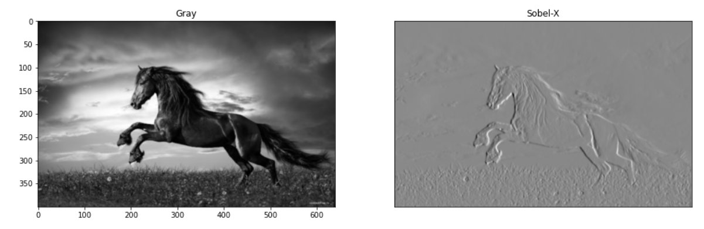
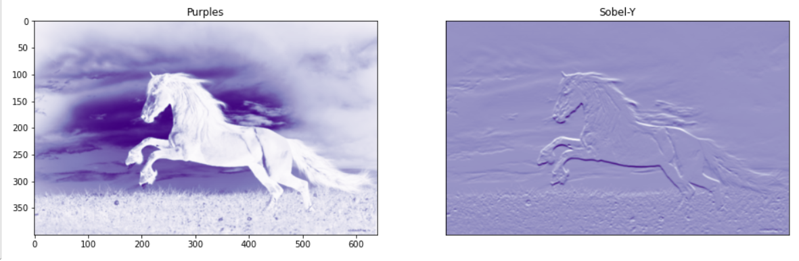
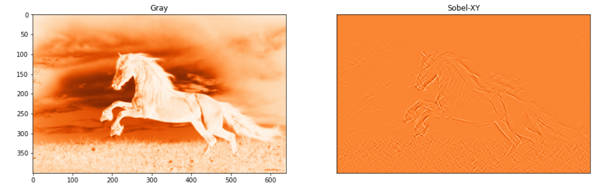
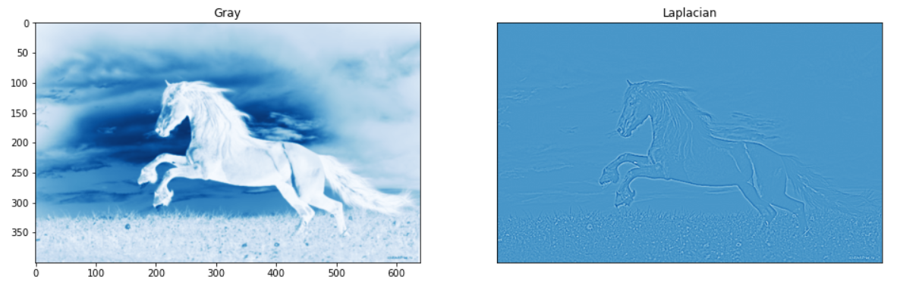
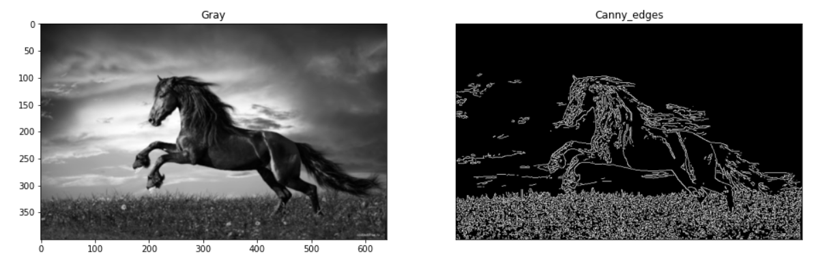

# Edge-Detection

## Aim:

To perform edge detection using Sobel, Laplacian, and Canny edge detectors.

## Software Required:
Anaconda - Python 3.7

## Algorithm:

### Step 1:

Import the required packages for further process.

### Step 2:

Read the image and convert the rgb image to gray scale image.

### Step 3:

Use filters for smoothing the image to reduce the noise.

### Step 4:

Apply the respective filters - Sobel, Laplacian edge detector and Canny edge detector.

### Step 5:

Display the filtered image using plot and imshow.
 
## Program:
~~~
Developed by : Ragul AC
Reg. No.: 212221240042
~~~
### Sobel X:

```
import cv2
import matplotlib.pyplot as plt
image=cv2.imread("image1.jpg")
gray_img=cv2.cvtColor(image,cv2.COLOR_BGR2GRAY)
img=cv2.GaussianBlur(gray_img,(3,3),0)
sobelx=cv2.Sobel(img,cv2.CV_64F,1,0,ksize=5)
sobely=cv2.Sobel(img,cv2.CV_64F,0,1,ksize=5)
sobelxy=cv2.Sobel(img,cv2.CV_64F,1,1,ksize=5)
plt.figure(figsize=(16,16))
plt.subplot(1,2,1)
plt.imshow(img,cmap='gray')
plt.title('Gray')
plt.subplot(1,2,2)
plt.imshow(sobelx,cmap='gray')
plt.title("Sobel-X")
plt.xticks([])
plt.yticks([])
plt.show()
```
### Sobel Y:
```
import cv2
import matplotlib.pyplot as plt
image=cv2.imread("image1.jpg")
gray_img=cv2.cvtColor(image,cv2.COLOR_BGR2GRAY)
img=cv2.GaussianBlur(gray_img,(3,3),0)
sobely=cv2.Sobel(img,cv2.CV_64F,0,1,ksize=5)
plt.figure(figsize=(16,16))
plt.subplot(1,2,1)
plt.imshow(img,cmap='Purples')
plt.title('Purples')
plt.subplot(1,2,2)
plt.imshow(sobely,cmap='Purples')
plt.title("Sobel-Y")
plt.xticks([])
plt.yticks([])
plt.show()
```

## Sobel XY:

```
import cv2
import matplotlib.pyplot as plt
image=cv2.imread("image1.jpg")
gray_img=cv2.cvtColor(image,cv2.COLOR_BGR2GRAY)
img=cv2.GaussianBlur(gray_img,(3,3),0)
sobelxy=cv2.Sobel(img,cv2.CV_64F,1,1,ksize=5)
plt.figure(figsize=(16,16))
plt.subplot(1,2,1)
plt.imshow(img,cmap='Oranges')
plt.title('Gray')
plt.subplot(1,2,2)
plt.imshow(sobelxy,cmap='Oranges')
plt.title("Sobel-XY")
plt.xticks([])
plt.yticks([])
plt.show()
```

 ## Laplacian edge detector:

```
import cv2
import matplotlib.pyplot as plt
image=cv2.imread("image1.jpg")
gray_img=cv2.cvtColor(image,cv2.COLOR_BGR2GRAY)
img=cv2.GaussianBlur(gray_img,(3,3),0)
laplacian = cv2.Laplacian(img,cv2.CV_64F)
plt.figure(figsize=(16,16))
plt.subplot(1,2,1)
plt.imshow(img,cmap='Blues')
plt.title('Gray')
plt.subplot(1,2,2)
plt.imshow(laplacian,cmap='Blues')
plt.title("Laplacian")
plt.xticks([])
plt.yticks([])
plt.show()
```


## Canny edge detector:

```
import cv2
import matplotlib.pyplot as plt
image=cv2.imread("image1.jpg")
gray_img=cv2.cvtColor(image,cv2.COLOR_BGR2GRAY)
img=cv2.GaussianBlur(gray_img,(3,3),0)
canny_edges = cv2.Canny(image, 120, 150)
plt.figure(figsize=(16,16))
plt.subplot(1,2,1)
plt.imshow(img,cmap='gray')
plt.title('Gray')
plt.subplot(1,2,2)
plt.imshow(canny_edges,cmap='gray')
plt.title("Canny_edges")
plt.xticks([])
plt.yticks([])
plt.show()
```

# Output:

## Sobel edge detector:

### Sobel X:



### Sobel Y:



### Sobel XY:



## Laplacian edge detector:



## Canny edge detector:



## Result:
Thus the edges are detected using Sobel, Laplacian, and Canny edge detectors.
